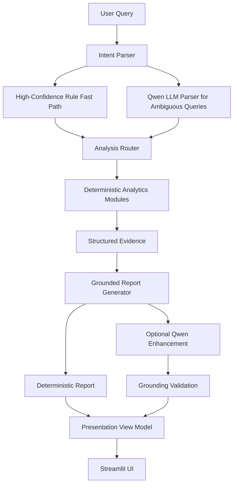

# AI Product Data Analyst

Natural-language product analytics with deterministic evidence and grounded AI reporting.

中文简介：一个将自然语言问题转换为结构化数据分析证据与 Grounded Report 的产品数据分析 Copilot。

Traditional product analysis often requires analysts to manually move through SQL, Python, segmentation, experiment checks, and report writing. This project explores a hybrid workflow where a user asks a product question and the system performs:

```text
Intent Understanding → Analytical Routing → Evidence Generation → Grounded Report
```

For example:

> Why did publishing rate decline on 2026-08-31?

The system identifies analytical intent, runs deterministic Python/DuckDB modules, constructs inspectable evidence, and produces a grounded report.

## Demo

The project currently runs locally with Streamlit. Add local screenshots after capture:

```html
<!-- Add Streamlit demo screenshots here:
- docs/images/demo_trend.png
- docs/images/demo_anomaly.png
- docs/images/demo_evidence.png
-->
```

## What It Can Do

| Question Type | Example | Output |
| --- | --- | --- |
| Metric Query | `2026-08-31 的发布率是多少？` | Publishing-rate metric value |
| Trend Analysis | `分析最近 7 天发布率趋势` | Trend statistics and a line chart |
| Anomaly Diagnosis | `为什么 2026-08-31 发布率下降了？` | Baseline, target, segment contribution, experiment, and external-factor evidence |
| Experiment Analysis | `最近实验是否影响发布率？` | Lift, p-value, and statistical interpretation |

## Architecture



## Why Hybrid AI?

This project does not delegate analytical computation to an LLM.

### Deterministic analytics

Python, DuckDB, and Parquet data perform:

- publishing-rate calculation
- seven-day trend calculation
- segment contribution analysis
- experiment effect and p-value calculation
- structured evidence construction

### LLM responsibilities

The local Qwen model is used only for:

- understanding ambiguous natural-language questions
- optional wording enhancement for reports

### Grounding

Structured evidence is the source of truth. The LLM is instructed not to invent metrics, experiments, or causal claims. Unsupported causal or significance claims are rejected and the system falls back to a deterministic report.

## Fast Path

Obvious requests do not need an LLM round trip. For example:

```text
2026-08-31 的发布率是多少？
```

uses:

```text
rule_fast_path → Analysis Router → Evidence → Deterministic Report
```

This reduces latency and improves reliability. Ambiguous or conflicting questions are delegated to the Qwen intent parser instead.

## Visualization

All visualizations are derived from structured evidence, never generated by the LLM.

- **Metric Query**: publishing-rate metric card
- **Trend Analysis**: seven-day publishing-rate line chart
- **Anomaly Diagnosis**: baseline/target metrics and negative-segment horizontal bar chart
- **Experiment Analysis**: compact experiment metrics; control/treatment comparison only when both rates are available

The presentation layer converts raw analytical results into stable UI view models, so Streamlit does not depend directly on raw analytics schemas.

## Performance

Fast Mode benchmark results from local testing:

| Query | Parser Source | Parse (ms) | Analysis (ms) | Report (ms) | Total (ms) |
| --- | --- | ---: | ---: | ---: | ---: |
| Metric Query | `rule_fast_path` | 0.65 | 24.86 | 0.01 | 25.52 |
| Trend Analysis | `rule_fast_path` | 0.54 | 27.67 | 0.02 | 28.23 |
| Anomaly Diagnosis | `rule_fast_path` | 0.58 | 451.66 | 0.04 | 452.28 |
| Experiment Analysis | `rule_fast_path` | 0.55 | 47.56 | 0.01 | 48.12 |

For an AI Enhanced anomaly report, local Qwen report generation reached the configured 90-second timeout and then safely fell back to deterministic reporting. This motivated **Fast Mode** as the default demo path.

## Quick Start

### 1. Create and activate a virtual environment

```bash
python -m venv .venv
```

Windows PowerShell:

```powershell
.venv\Scripts\Activate.ps1
```

Windows Command Prompt:

```cmd
.venv\Scripts\activate
```

### 2. Install dependencies

```bash
pip install -r requirements.txt
```

### 3. Generate demo data if needed

```bash
python src/generate_data.py
```

### 4. Start the application

```bash
streamlit run app/streamlit_app.py
```

### Optional: Ollama and Qwen

Fast Mode skips Qwen report generation for speed. Ambiguous questions can still use the intent parser when Ollama is available. AI Enhanced mode requires a running Ollama service and a configured local model.

Defaults supported by `src/llm_client.py`:

```text
OLLAMA_BASE_URL=http://127.0.0.1:11434
OLLAMA_MODEL=qwen2.5:7b
```

## Tests

The project currently has **33/33 passing** unit tests covering:

- intent parsing and rule fast paths
- router behavior
- report generation and deterministic fallback
- grounding fallback
- presentation formatting
- visualization view-model preparation

Run all tests:

```bash
python -m unittest discover -s tests -v
```

## Project Structure

```text
app/
  streamlit_app.py          Streamlit chat interface and visualization rendering

data/
  product_events.parquet    Generated synthetic product-event data
  experiments.parquet       Generated synthetic experiment metadata
  experiment_exposures.parquet
                            Generated synthetic experiment exposure data

src/
  generate_data.py          Reproducible synthetic data generator
  diagnose.py               Publishing-rate and segment contribution analysis
  experiment_impact.py      Experiment overlap, lift, and p-value analysis
  external_factors.py       Holiday and school-break context
  intent_parser.py          Hybrid fast-path and LLM intent parsing
  llm_client.py             Safe local Ollama HTTP client
  router.py                 Intent-to-analysis routing
  report_generator.py       Grounded report generation and deterministic fallback
  presentation.py           Formatting and UI view-model preparation

tests/
  test_ai_v1.py             Intent parser tests
  test_router.py            Router tests
  test_report_generator.py  Report and fallback tests
  test_presentation.py      Formatting and visualization-view tests

requirements.txt            Runtime dependencies
```

## Key Design Decisions

### 1. Hybrid intent routing

Rules handle obvious queries; the LLM handles ambiguity.

### 2. Evidence before language

The system analyzes first and generates language second. LLM output does not calculate metrics or statistics.

### 3. Deterministic fallback

LLM latency, unavailability, or unsupported claims do not break analytics. A readable deterministic report remains available.

### 4. Presentation separated from analytics

```text
Router Result → Presentation View Model → UI
```

This keeps the UI independent from raw analytical schemas and makes visualization failures fail soft.

## Known Limitations

- The demo supports a limited set of product analytics intents.
- Local LLM latency can be high.
- External-factor evidence is based on the current synthetic demo dataset.
- The system does not support arbitrary SQL generation.
- Multi-turn analytical context is limited.
- This is a portfolio prototype, not a production analytics platform.

## Future Work

- Additional product metrics
- Multi-turn analytical context
- Configurable analytical tools
- Faster local models or hosted LLMs
- Richer experiment diagnostics
- Dataset upload and schema adaptation
